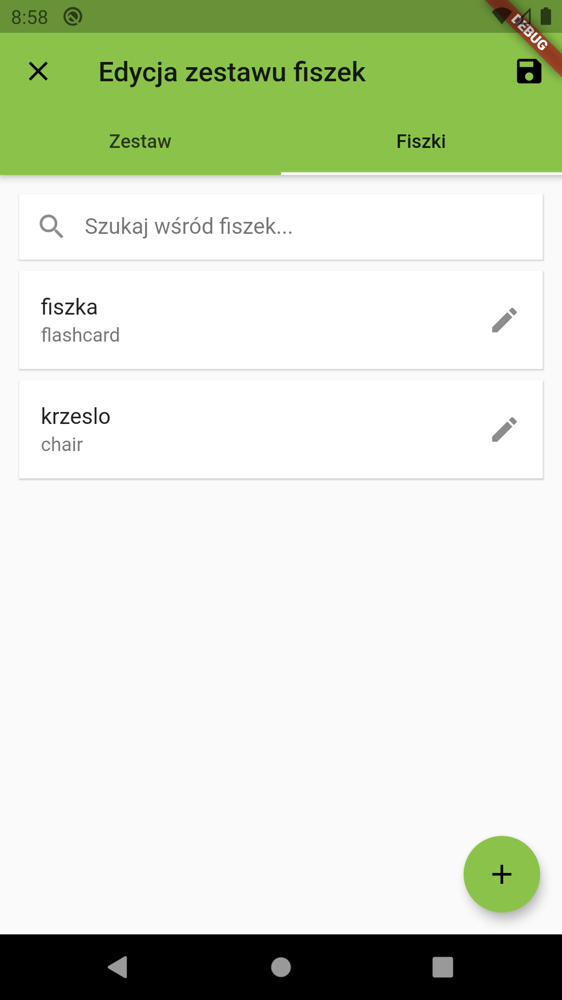
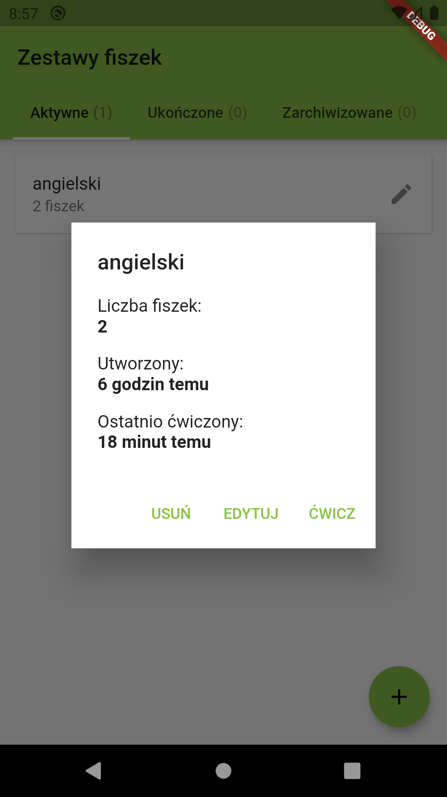
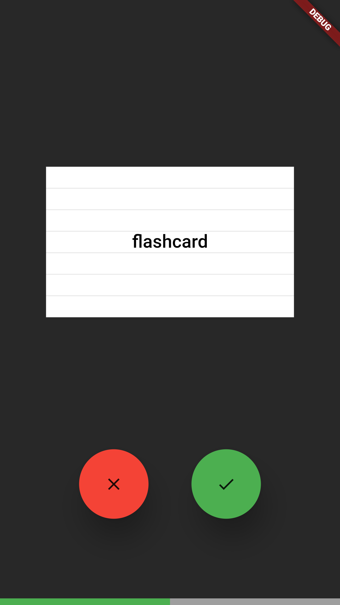
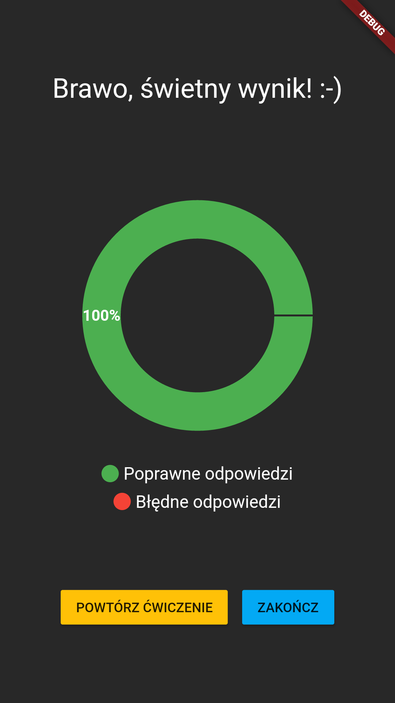

# Fiszker

💡 Flashcards, simply.

This is a very much **work in progress** - currently there's only Polish translation available and
there are no builds at GitHub, Google Play or AppStore. You can `git clone` the application and
`flutter run` it on your own though.

## Screenshots

## Goals

- Free as in "free beer"
- Simple, performant, Material-Design-compliant interface
- Server-free - everything's stored solely on users' phones
- Android & iOS support

## Pending tasks

### Before first release

- Get rid of all the current `@todo`s in both README and code
- Write some tests
- Upload application to Google Play

### After first release

- Add English translation
- Implement more exercise types
- Implement exercising statistics
- Improve UI's interactivity (e.g. animate deleing a deck)
- Optimize UI for tables (currently it's totally unprepared for landscape views)
- Implement graphics cards
- Implement learning models (like the Leitner system)
- Implement syncing decks via Bluetooth (if it's possible at all)

## Architecture

See: [docs/architecture.md](docs/architecture.md)

## Contributing

See: [docs/contributing.md](docs/contributing.md)

## License

Copyright (c) 2019, Patryk Wychowaniec, wychowaniec.patryk@gmail.com.    
Licensed under the MIT / Postcardware license.
